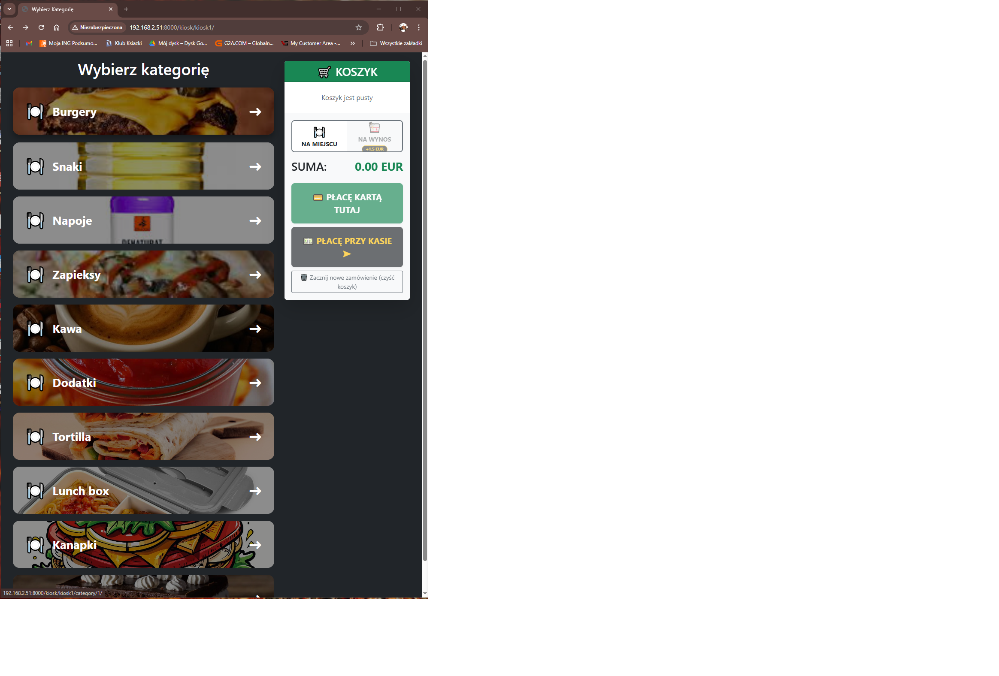
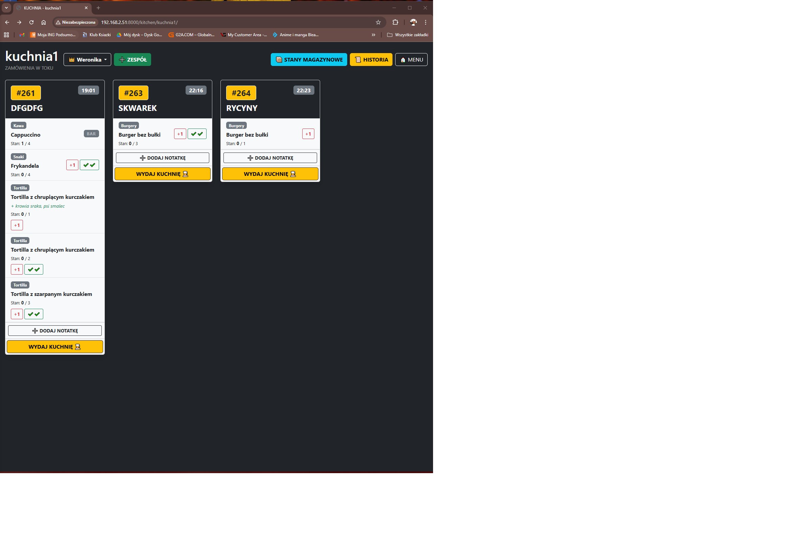
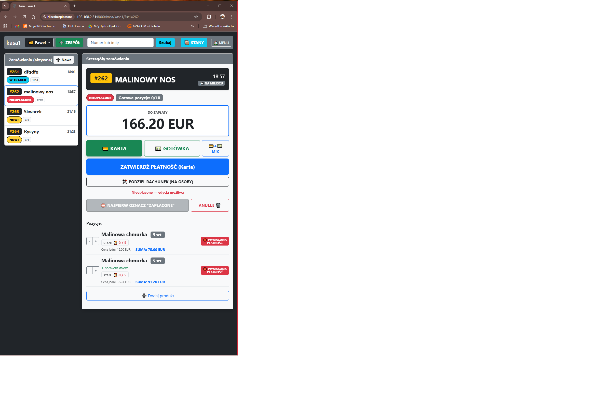

# GastroPOS - System Zarządzania Lokalem Gastronomicznym

Kompleksowy system typu POS (Point of Sale) stworzony w Django, obsługujący pełny obieg zamówienia w restauracji: od kiosku samoobsługowego, przez KDS (Kitchen Display System) na kuchni, aż po stanowisko kasjerskie.

System rozwiązuje problem synchronizacji zamówień w czasie rzeczywistym i zarządzania stanami magazynowymi (w tym półproduktami).

## 🚀 Główne Funkcjonalności

### 🍔 Kiosk Samoobsługowy
* Interfejs dla klienta końcowego (dotykowy).
* **Live Stock Management:** Blokowanie zamówień w czasie rzeczywistym, gdy brakuje składników (transakcje atomowe).
* Obsługa wariantów produktów (dodatki, usuwanie składników).
* Wybór metody płatności i rodzaju zamówienia (na miejscu / na wynos).

### 👨‍🍳 KDS (Ekran Kuchenny)
* Podgląd zamówień w czasie rzeczywistym.
* Grupowanie tych samych produktów w celu optymalizacji pracy kucharza.
* Oznaczanie statusów (W trakcie -> Gotowe).
* **Auto-wylogowanie:** Zabezpieczenie stanowiska po godzinach pracy z możliwością konfiguracji czasu per stanowisko.

### 💻 Stanowisko Kasjerskie (POS)
* Przyjmowanie zamówień przy ladzie.
* Obsługa płatności mieszanych (Gotówka + Karta).
* Zarządzanie wydawką (Bar / Kuchnia).
* Anulowanie zamówień ze zwrotem towaru na stan magazynowy (Logika odwróconej transakcji).

### ⚙️ Panel Administracyjny (Back-office)
* Zarządzanie magazynem i recepturami (półprodukty).
* Raportowanie: Generowanie dziennych raportów sprzedaży do PDF.
* Audit Log: Pełna historia działań pracowników.
* Konfiguracja stanowisk (włączanie/wyłączanie auto-wylogowania).

## 🤖 Metodyka pracy / AI Assistance

Projekt ten powstał jako *Proof of Concept* możliwości **AI-Assisted Software Development**.

Kod został zaimplementowany w modelu *Human-in-the-loop* przy użyciu modelu LLM (Gemini/GPT). Moja rola jako twórcy polegała na:
* **Architekturze systemu:** Projektowanie relacji bazy danych i przepływu informacji (Data Flow).
* **Definiowaniu logiki biznesowej:** Określanie zasad działania transakcji, blokad magazynowych i synchronizacji.
* **Debugowaniu i Integracji:** Weryfikacja generowanego kodu, rozwiązywanie konfliktów i łączenie modułów w działającą całość.
* **Prompt Engineering:** Precyzyjne sterowanie modelem w celu uzyskania bezpiecznego i optymalnego kodu (np. użycie `transaction.atomic` czy `select_for_update`).

## 🛠 Technologie

* **Backend:** Python 3.12, Django 5.x
* **Baza danych:** SQLite (dev) / PostgreSQL (ready)
* **Frontend:** HTML5, CSS3 (Bootstrap), JavaScript (AJAX polling & auto-refresh logic)
* **Inne:** `xhtml2pdf` (generowanie raportów), `django-admin-interface`, `python-decouple`

## 📸 Zrzuty ekranu

*(Widok Kiosku)*


*(Widok Kuchni KDS)*


*(Widok Kasjera)*


## 📦 Instalacja i uruchomienie

1.  Sklonuj repozytorium:
    ```bash
    git clone [https://github.com/twoj-nick/gastro-pos.git](https://github.com/twoj-nick/gastro-pos.git)
    ```
2.  Stwórz i aktywuj wirtualne środowisko:
    ```bash
    python -m venv venv
    source venv/bin/activate  # Linux/Mac
    # venv\Scripts\activate   # Windows
    ```
3.  Zainstaluj zależności:
    ```bash
    pip install -r requirements.txt
    ```
4.  Skonfiguruj zmienne środowiskowe:
    * Utwórz plik `.env` na podstawie `.env.example` (lub wpisz własne klucze).
5.  Wykonaj migracje i uruchom serwer:
    ```bash
    python manage.py migrate
    python manage.py runserver
    ```

## Autor

**Paweł N.**
*Projekt zrealizowany w 2025/2026.*